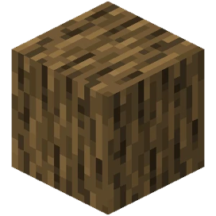
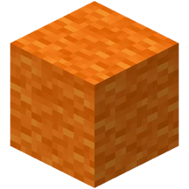
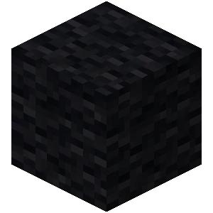
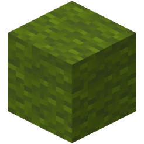

# Bound-in-Minecraft
我的世界反弹球游戏

### 效果预览

用Minecraft中人物的位置来控制条状反弹球拍，用橘黄色羊毛方块来表示小球，用绿色的羊毛方块来表示球拍，用灰色的羊毛和木头填充背景。

      

### 运行环境

Minecraft 版本：1.12.2

参考[环境安装教程](https://ngcm.github.io/PythonTool-Mod/installation/)，安装 [Forge](https://ngcm.github.io/PythonTool-Mod/downloads/) 、RaspberryJamMod、python-scripts。

安装第三方库mcpi

### 运行方式

先启动我的世界，然后运行程序即可。
